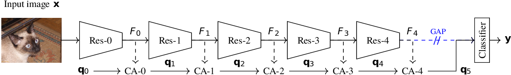

# CA-Stream: Attention-based pooling for interpretable image recognition

## Overview
Oficial implementation of the paper: [CA-Stream: Attention-based pooling for interpretable image recognition](https://arxiv.org/pdf/2404.14996) (3rd CVPR Workshop on Explainable AI - 2024)

## Cross Attention Stream
Our work consists of a trainable cross attention stream, running in parallel to existing CNNs, enhancing interpretable properties. Inspired by the classification token from transformers, we learn a CLS token that is updated with information at key points of a model, replacing GAP during inference to produce explanations.

## Getting Started
### Requirements
- einops >= 0.7.0
- opencv-python >= 4.8.1.78
- python >= 3.11.5
- python-hostlist >=1.23.0
- pytorch >= 2.1.0
- timm >=0.9.10
- torchvision >= 0.16.0
- tensorboard >= 2.15.1
- grad-cam >= 1.4.8

### Training

### Classification and Saliency Generation

### Interpretable Evaluation

### Citation
@misc\{torres2024castream,<\br>
      title=\{CA-Stream: Attention-based pooling for interpretable image recognition\},<\br>
      author=\{Felipe Torres and Hanwei Zhang and Ronan Sicre and Stéphane Ayache and Yannis Avrithis\},<\br>
      year=\{2024\},<\br>
      eprint=\{2404.14996\},<\br>
      archivePrefix=\{arXiv\},<\br>
      \}
### Acknowledgements
