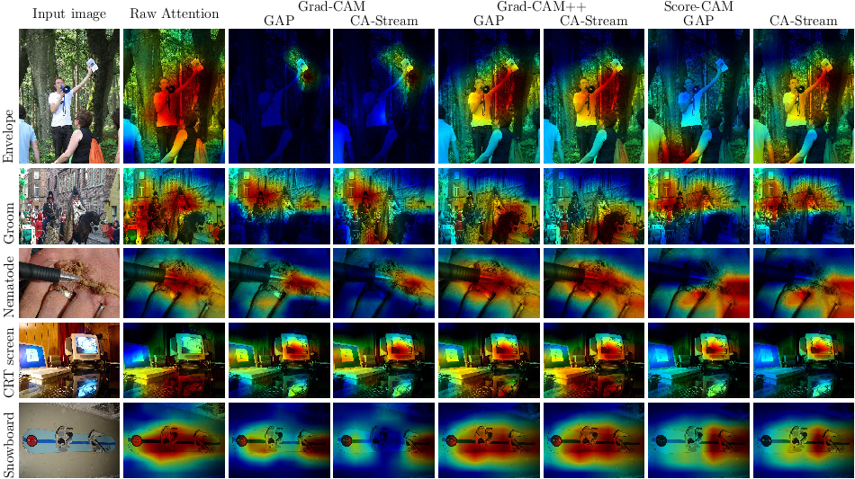

# CA-Stream: Attention-based pooling for interpretable image recognition

## Overview
Oficial implementation of the article: [CA-Stream: Attention-based pooling for interpretable image recognition](https://arxiv.org/pdf/2404.14996) (3rd CVPR Workshop on Explainable AI - 2024)

We also provide support material such as the [poster](assets/CA_Poster.pdf) and brief introductory [slides](assets/CA_Slides.pdf).

## Cross Attention Stream
Our work consists of a trainable cross attention stream, running in parallel to existing CNNs, enhancing interpretable properties. Inspired by the classification token from transformers, we learn a CLS token that is updated with information at key points of a model, replacing GAP during inference to produce explanations.

 

## Getting Started
### Requirements
- einops >= 0.7.0
- opencv-python >= 4.8.1.78
- python >= 3.11.5
- python-hostlist >=1.23.0
- pytorch >= 2.1.0
- timm >=0.9.10
- torchvision >= 0.16.0
- tensorboard >= 2.15.1
- grad-cam >= 1.4.8

### Training
To train our approach on different datasets, follow the dataset-specific scripts found in routines/training. We provide files with the annotations for different datasets on data. 
 
Our training scripts are structured in the following manner:
- **Training settings** Defines how many epochs, the initial learning rate, optimizers,  criterion and gpu acceleration for the training procedure. Optional hyperparameters control resuming training, the scheduler, the usage of warm-up and mixup/cutmix augmentations. 
- **Data initialization** Defines the root where data is located, the batchsize, the saving iterations if saving intermediate models during epochs, the fraction of the data to use for training, a random seed for shuffling data and allowing reproducible results. 
- **Model Settings** These hyperparameters control the model selection. How many classes to use, the starting weights, and the cross attention behaviour.

For instance: 

``python main_INets.py --root_data [Root ImageNet] --path_list data/ --model [model] --classes 1000 --epochs 90 --imsize 224 --store_dir [path to storage] --batch_size [batch size per gpu] --s_iterations [checkpoint every N epochs] --fixed --seed [when enabling fixed seeds, the seed to use] --criterion [loss function]``

We divide the evaluation procedure of our approach into two steps. First we run the step on *Classification and Saliency Map Generation*. Then, we run the step regarding *Interpretable Evaluation*.

### Classification and Saliency Generation
Similar to the training routines, the evaluation routine script follows a structure in the shape of:

- **Evaluation Settings** Allows control for the evaluation procedure, enabling saliency map generation, which attribution to use and toggles on/off the gpu usage. Additional hyperparameters define the saving path for evaluation reports.

- **Data initialization** Defines the root where data is located, the fraction of the validation set to use, as well as specific indexes to evaluate on if required. Additional hyperparameters control the batch size to use (some attributions might required bsz set to 1). It's completely optional the option to generate attributions for **groundtruth** labels or **predicted** labels. By default selects groundtruth labels.

- **Model Settings** Allows for model selection and loading weights.

For instance: 
``python recognition_imagenet.py --state_root [path_trained_model] --store_dir [path_to_evaluate] --root_data [root for data] --path_lbl [path for labels] --batch_size [batch size] --model [model] --use_gpu --classes [#Classes] --fraction [1 sets the whole validation set, else a random seed sampled fraction]``

### Interpretable Evaluation
Lastly, we evaluate our proposal following [Objective Evaluation for Object Recognition](https://arxiv.org/pdf/1710.11063) and the recent metric of *Average Gain*, poposed in [Opti-CAM](https://arxiv.org/pdf/1710.11063). Additionally, we provide an updated batched implementation of the **Insertion/Deletion** metrics found in the article [RISE: Randomized Input Sampling for Explanation of Black-box Models](https://arxiv.org/pdf/1806.07421). The evaluation script follows the structure:

- **Evaluation Settings** Sets the stage for evaluation. Toogles gpu usage, and defines the saving path for the report.

- **Data initialization** Defines the roots where data is stored, batch size, the fraction of data to use, and if required, specific indexes to evaluate with.

- **Model Settings** Allows for model selection and loading weights.

For instance:  
``python objrecon_imagenet.py --state_root [path_model] --store_dir [path_report] --root_data [root for data] --path_lbl [path for labels] --batch_size 60 --model [model] --use_gpu --classes [#Classes]``

### Citation

@misc\{torres2024castream, 
title=\{CA-Stream: Attention-based pooling for interpretable image recognition\}, 
author=\{Felipe Torres and Hanwei Zhang and Ronan Sicre and Stéphane Ayache and Yannis Avrithis\}, 
year=\{2024\} 
\}

